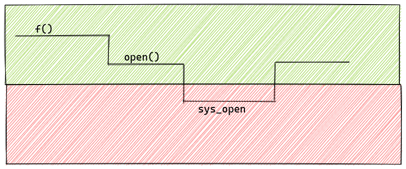

# ISS - Cours 2

## Pile

Géré de façon logiciel, représente la pile des instructions qui s'executeront
dans le processeur

---

## Processus

Logiciels lancés (ex: TP, Firefox, VLC)

/!\ Linux n'est pas un processus

---

## Interruptions

3 types:

- Hardware (ex: horloge, clavier, etc...)
- Logiciel (erreurs)
- Logiciel (appel système)

/!\ Seul manière de passer en mode S

Appel système:

