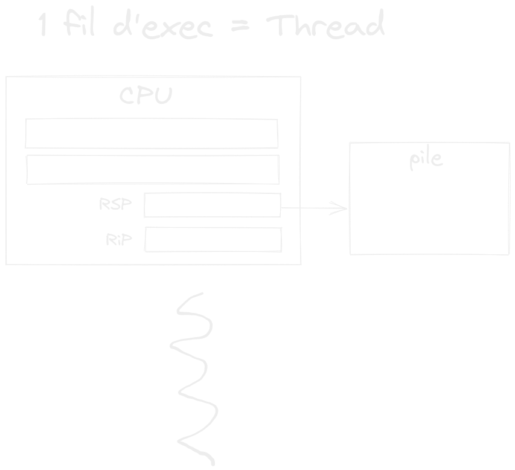
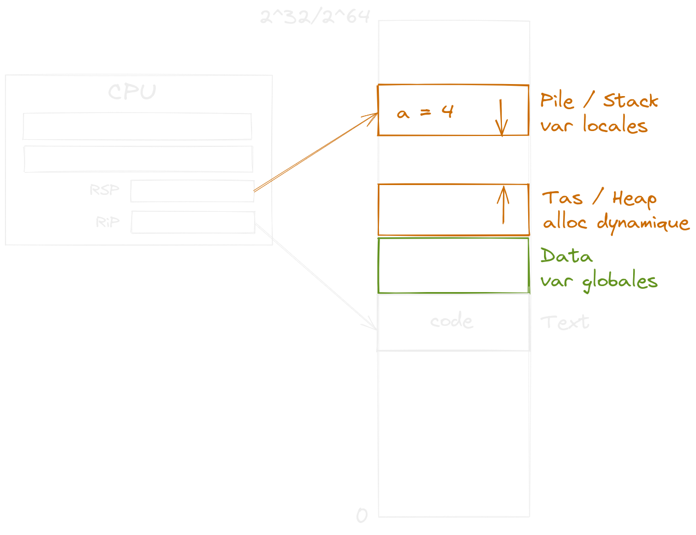
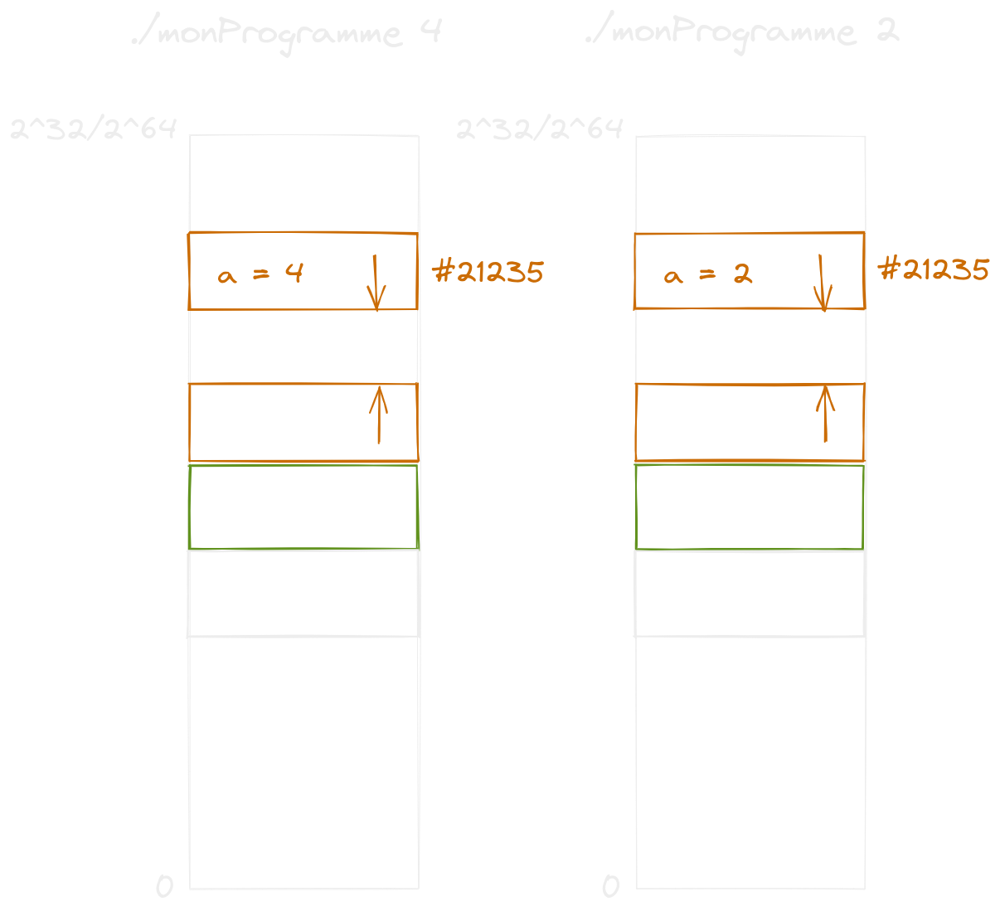
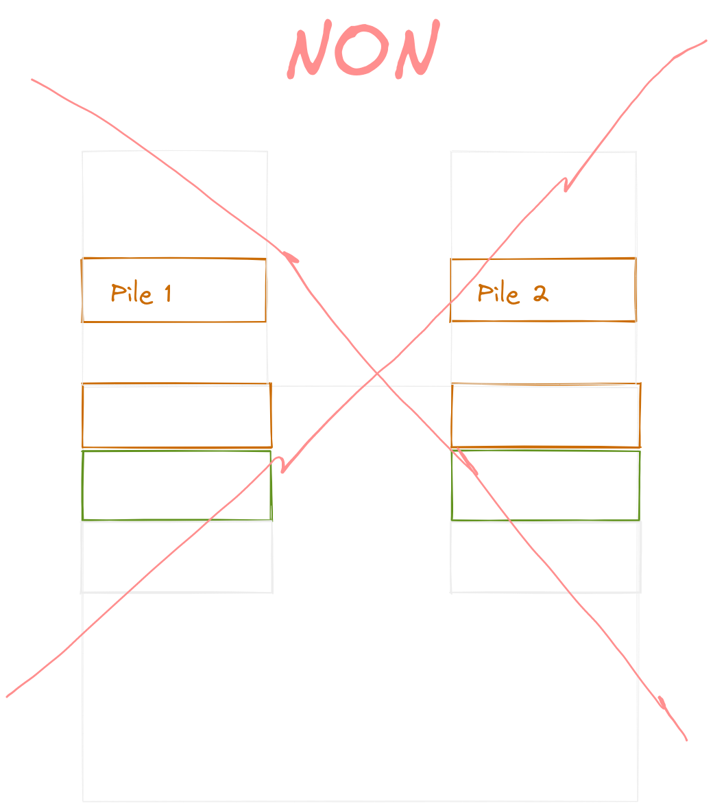
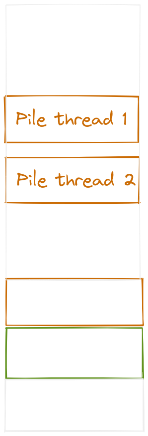

# Cours 3

## Rappel: Processus

- Caractérisé par un fil d'execution

## Thread



On considère qu'un thread est la même chose qu'un processus pour la licence
mais on verra en master que c'est différent.

## Mémoire Virtuelle

---

### Technique pour estimer l'ordre de grandeur des puissances de 2

```
2^32 = 2^(10+10+10+2) = 2^10 + 2^10 + 2^10 + 2^2
                     ~= 1000 * 1000 * 1000 * 4
                     ~= 4 000 000 000
```

---



Ce programme en C :

```c
#include <stdlib.h>
#include <stdio.h>
#include <unistd.h>

int main (int argc, char *argv[])
{
  int a = run(atoi(argv[1]));
  while(1) {
    printf("%p : %d", &a, a);
    sleep(1);
  }
}
```

donne la même adresse pour des arguments différents



La mémoire telle qu'elle est vue par les processus est virtuelle, et les adresses ne correspondent pas aux adresses physiques.

Il existe une table de transcription entre les adresses virtuelles et les adresses
physiques. Cette table est physique.




## Résumé

- Thread: fil d'éxécution
- Processus: espace d'adressage virtuel
- Les adresses mémoire dans un thread ne sont pas les mêmes que les adresses physiques sur la ram.
