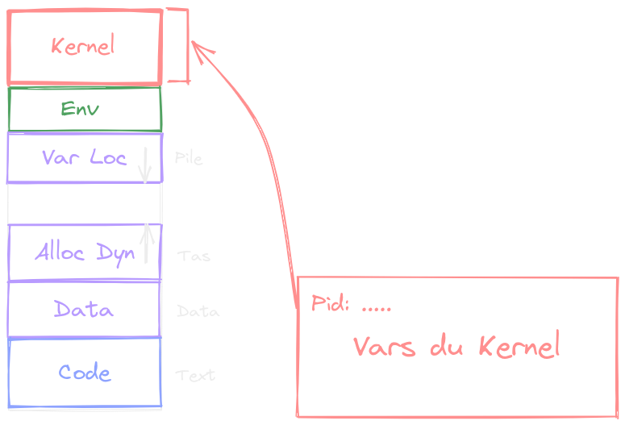
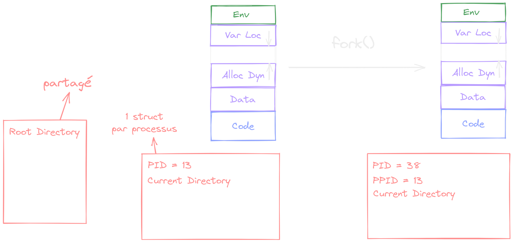

# Cours 5

## Variables du Kernel

Quand un processus devient un "superprocessus", il:

- a accès aux variables du kernel
- peut executer toutes les instructions système
- a accès à toutes les addresses



## Fork

```C
int main() {
  int x = 0;
  printf("%d", x);
  int p = fork(); // p = 0 si père, sinon pid du fils
  if (p == 0) {
    x = 3;
  }
  printf("%d", x);
}
```


