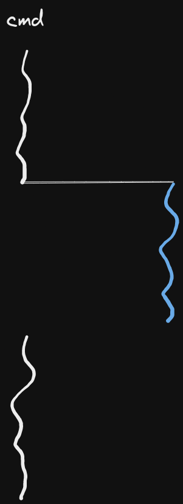
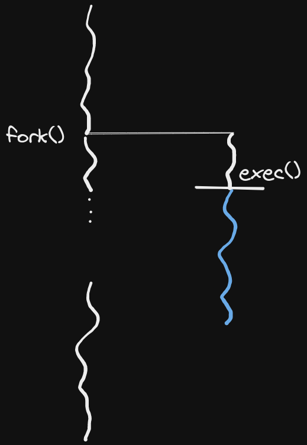
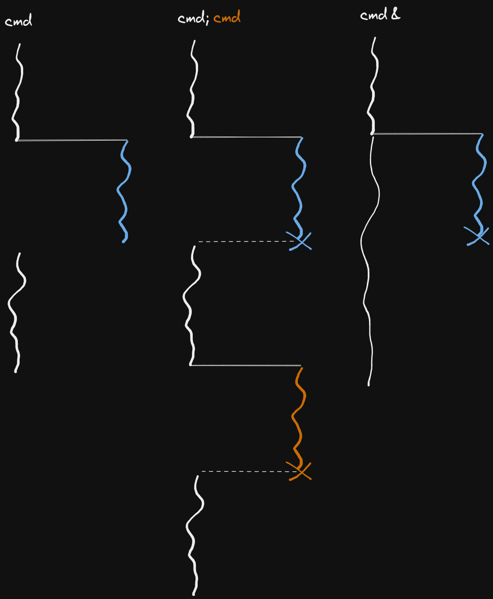
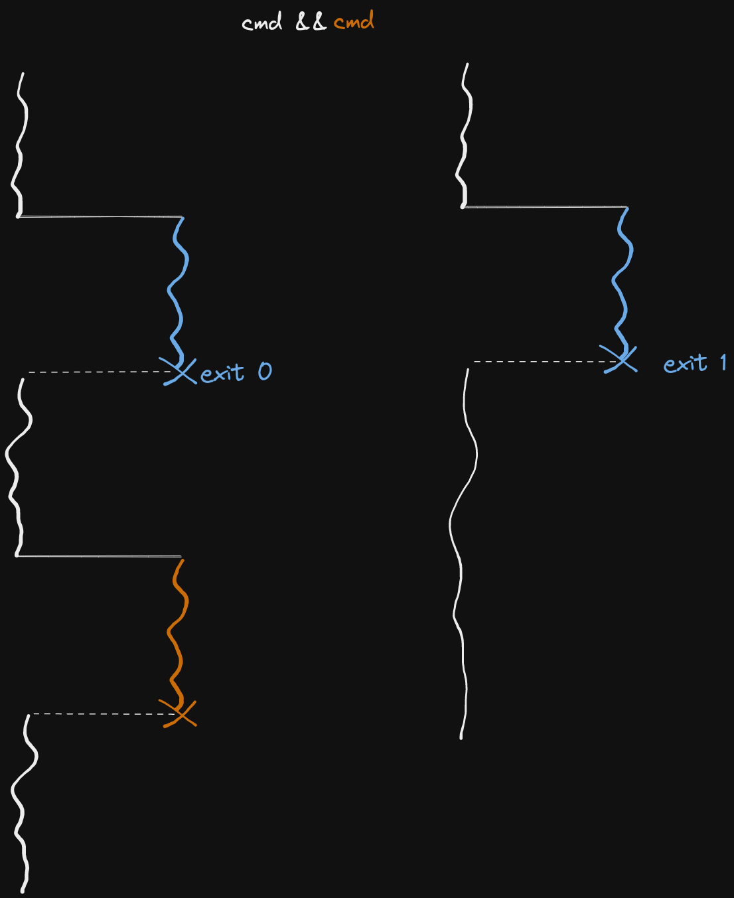
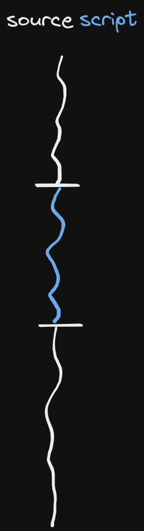
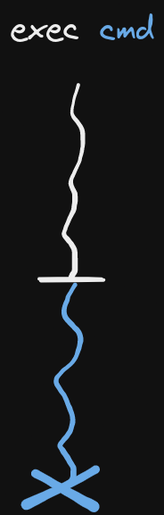
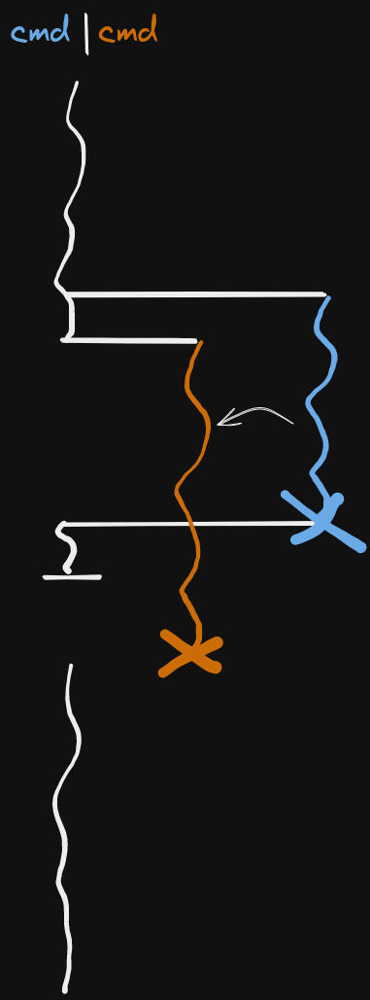
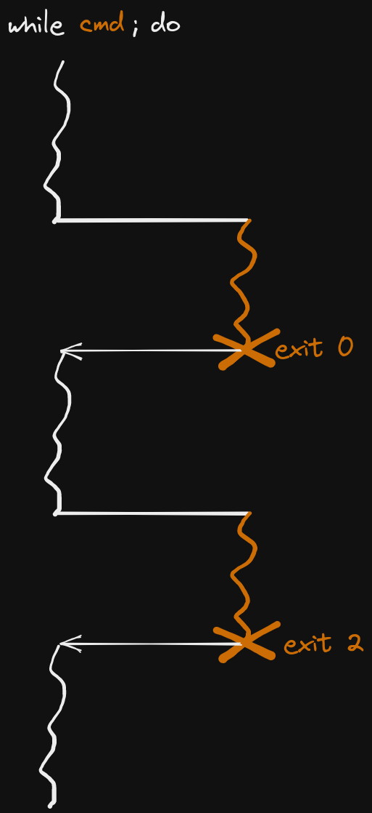
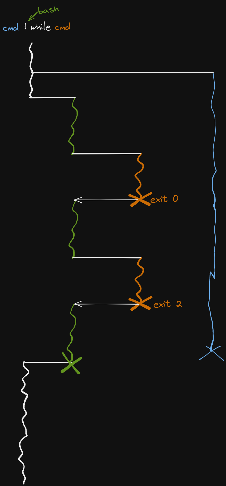

# Cours 7

Lorsqu'une commande `cmd` lance un processus :



Le processus `cmd` fait un `fork()` puis un `exec()`.



En C:

```c
if (fork() == 0)
  // ...
  exec();
  // ...
```



Lorsque l'on utilise `&&`, l'évaluation se fait de façon progressive. La première commande
est évaluée, et si elle retourne `0` (vrai) alors on lance la duxième. Ainsi, on peut utiliser
le `&&` comme uun `if`.

```bash
if [ cmd1 ]; then
  cmd2
fi

# Equivalent à

[ cmd1 ] && cmd2
```



`source script` ou `. script` execute les commandes du script dans le processus actuel (comme si les commandes
avaient été tappées une par une)



`exec cmd` remplace le processus du shell par celui de la commande



`cd` est un builtin






Bug rencontré pendant un TME :


