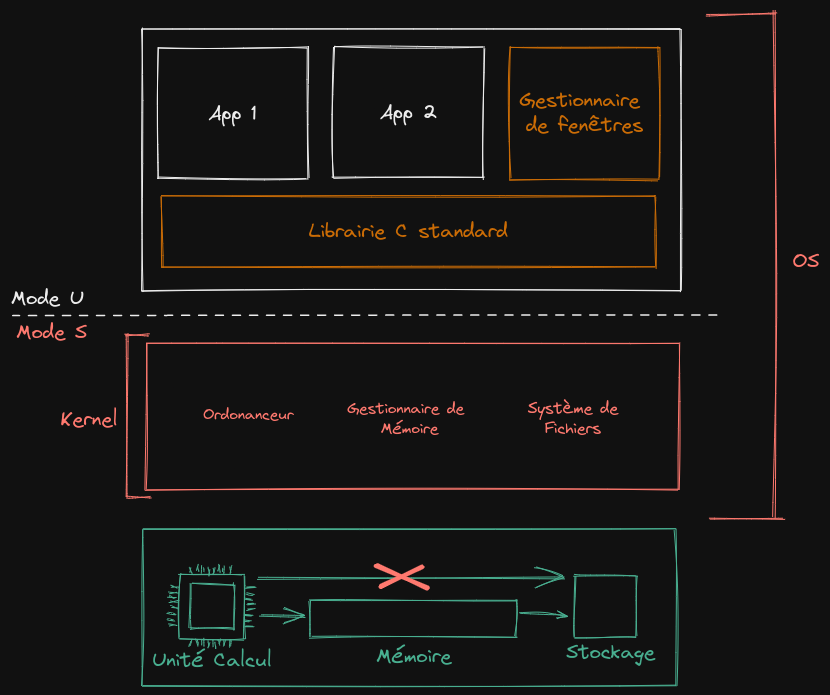
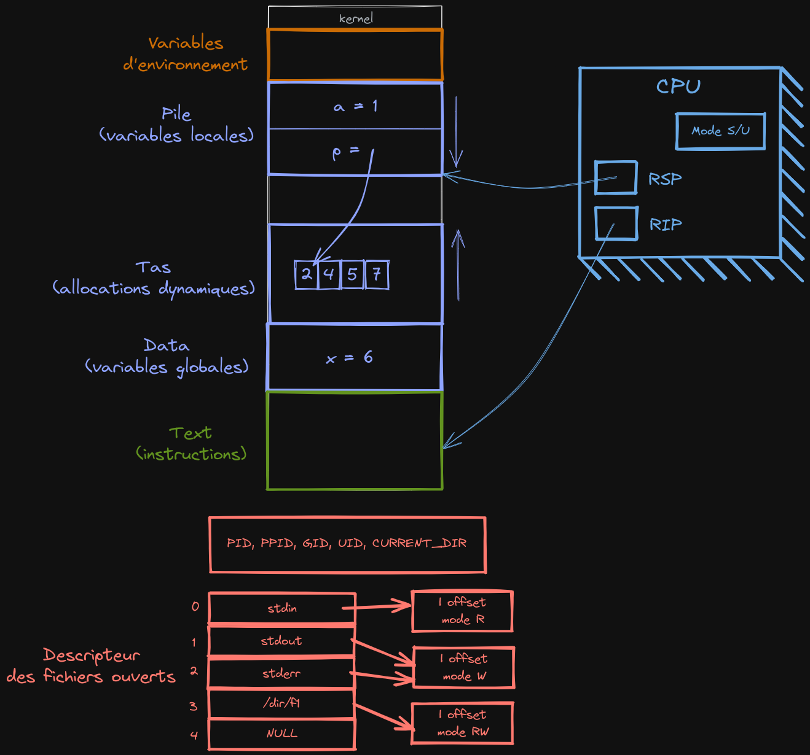
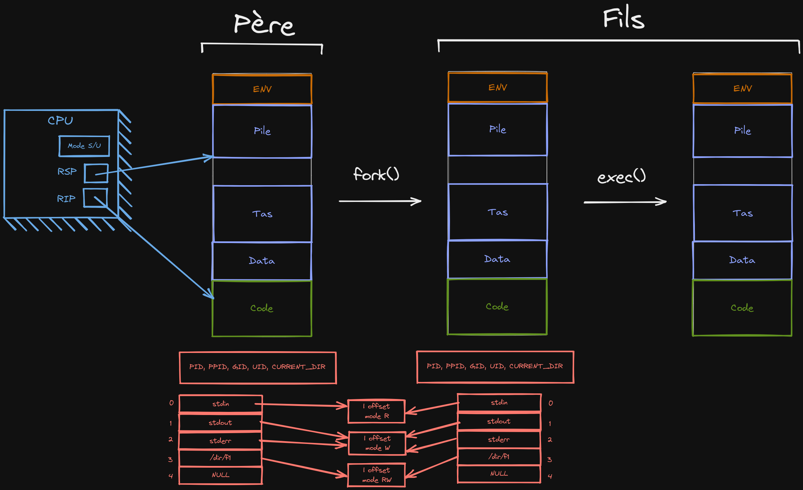
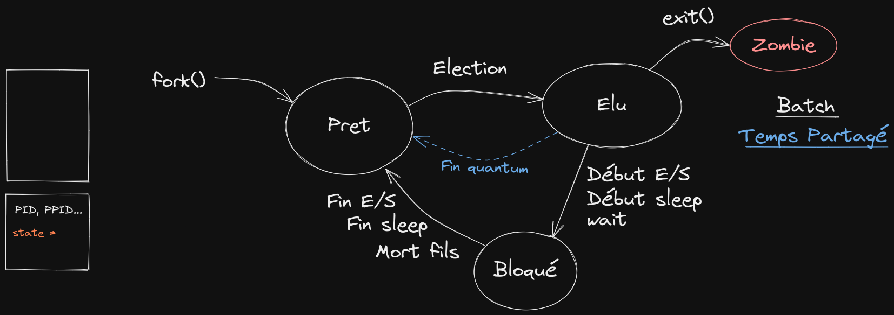

# Système

## Définitions

**Système:** couche logicielle qui offre une abstraction de ressources (matérielles ou logicielles)
au travers d'une API (Application Programming Interface)

**Système d'exploitation (OS):** Couche logicielle qui offre une abstraction du matériel
pour les application

**Noyau (kernel) de l'OS:** Partie de l'OS qui s'execute en mode prévilégié (Kernel Mode/Mode S)

L'**OS** est composé:

- d'un noyau

- d'une bibliothèque simplifiant l'accès aux fonctionnalités, notemment une bibliothèque standard C _(facultatif)_

- d'une interface graphique _(facultatif)_ - de services avancés comme des clients dhcp, ntp... _(facultatif)_

Le **noyau** est composé:

- d'un **ordonanceur** qui choisit quel fil d'execution s'éxecute dans le cpu à un instant donné

- d'un **gestionnaire de mémoire** qui est responsable de l'association des adresses avec la mémoire physique

- d'un **système de fichiers** qui tructure les données dans une arborescence et place/retrouve les données sur un support de stockage

Le **CPU** possède un **registre de contrôle** qui fixe le mode de fonctionnement

- mode dégradé (mode U) où:

  - certaines adresses ne sont pas accessibles

  - plusieurs instruction sont interdites

- mode kernel (mode S) où:

  - toutes les adresses sont accessibles

  - toutes les instructions peuvent êtres executées

**/!\ attention**, rien à voir avec le mode root/superuser/administrateur

Dans les composants qui gèrent les données, il y a:

- La **mémoire** dont les données sont accessibles directement par le CPU, par octets

- Les **périphériques de stockage** qui sont le plus souvent accessibles par blocs,
  non accessibles par le CPU, nécessitant l'utilisation de requêtes à un controlleur de disques.



**Un thread** est caractérisé par un fil d'execution.

Un **processus** est un espace d'adressage virtuel.
Deux processus peuvent stocker une donnée différente dans la même adresse virtuelle, qui pointent sur des adresses physiques différents, en effet, chaque processus
a ses propres adresses virtuelles.
Chaque processus possède:

- **la pile** où sont stockées les variables locales

- **le tas** où les variables allouées dynamoquement sont stockées

- **le data** où sont stockées les variables globales

- un espace **text** où est stocké le ode (les instructions pour le processeur)

- **les variables d'environnement**

- **la table des fichiers ouverts**, où les premiers indices
  correspondent au stdin, stdout et stderr (d'où le `2>` pour rediriger l'erreur standard)

- les données du kernel sur le processus comme le PID, le PPID (pid du parent), le GID (id de groupe),
  l'UID (user id), le current_diretory.

Le CPU possède deux registres: le **RSP** qui pointe sur le bas de la pile, et le
**RIP** qui pointe sur l'instruction actuellement executée.



Lorsqu'un programme a besoin de réaliser une opération
qui ne peut qu'être faite que par le kernel, comme par exemple ouvrir un fichier, il fait un **appel système**.
Le processus passe alors en mode S lors de son execution sur le CPU. Un appel système cause une interruption. Des causes interruptions peuvent être:

- Hardware (ex: horloge, clavier, etc...)

- Logicielles (erreurs, appels système)

Un processus peut faire un appel système `fork()`, qui crée un processus fils similaire
à son père, avec comme différences:

- son **PID**

- son **PPID** qui est le PID du processus qui l'a créé

- la valeur de retour de l'appel fork(): 0 pour le fils et le PID du fils pour le père

Le fils execute le même code que le père, et puisque le processus père est cloné, le pointeur
RIP pointe toujours sur l'instruction de retour du fork().

Un autre appel système est `execX()` (execv(), execl()) et permet de changer le code qui
s'execute.

- Les données du kernel sont conservées (pid, ppid, uid, gid,...)

- les variables d'env sont préservées

- tout le reste de la mémoire est réinitialisée avec les variables du nouveau programme

- la pile correspond au `main()` du nouveau programme avec comme `argv[]` les paramètres d'appel à `exec()`

- le registre RIP est placé sur la première instruction du nouveau programme

/!\ exec() ne crée pas de nouveau processus, et comme tout est perdu, il n'est pas possible de revenir dans le code qui contenait le exec()



L'ordre de lancement d'instruction par les processus dans le processeur sont gérés par **L'ordonanceur**. Chaque
processus possède une donnée appéle son **état**. Les états possibles sont :

- prêt
- élu
- bloqué
- zombie

**Prêt** est l'état qui indique qu'un processus peut être élu pour executer des instructions dans les registres du processeur.

**Élu** est l'état où iun processeur a été choisi par l'ordonanceur

**Bloqué** est un état spécial où un processus attend d'avoir accès à un verrou qui lui permet de faire une certaine opération 
qui pourrait causer des problèmes si plusieurs processus la font en même temps.

**Zombie** est l'état dans le quel se met un processus après sa mort.

 

La **commutation** est le fait qu'un processus alterne avec un autre l'accès au processeur. Il existe deux modes : **batch** et **temps partagé**. En **batch**, il
peut y avoir commutation lorsqu'un processus fait par exemple de l'entrée sortie (écriture dans un fichier). En **temps partagé**, un processus a un quantum (unité de temps)
qui cause une commutation quand elle est dépassée. 

Il est possible d'éffectuer une synchronisation des actions avec la commande `wait`, qui permet d'attendre que les processus enfants terminent leurs actions (ie meurent)
pour débloquer les processus. 

Les processus peuvent communiquer entre eux par **signaux**. L'envoi d'un signal est capturé dans l'autre processus par un **handler**, qui executera une action
en fonction du signal. La liste des signaux peut être obtenue avec `kill -L` (voir la partie shell).

Les processus peuvent parfois causer des comportements innatendus si ils accèdent en même temps au même fichier, par exemple. Pour palier à cela, on
utilise des "barrières", qui permettent le blocage de tous les autres processus qui essayent de faire un certaine action. Il faut voir ça comme
une barrière possédant une clé, et un processus prend la clé en passant la barrière et le ferme. Les autres processus doivent donc attendre que le processus reveienne
et leur donne la clé pour passer.

# Shell

## Variables

```bash
var=bonjour
echo $var # Affiche bonjour
echo '$var' # Affiche $var


fichiers="a b c"
cat $fichiers # Affiche le contenu des fichiers a, b et c
cat "$fichiers" # Affiche le contenu du fichier "a b c" (avec les espaces dans le nom)
```

## Métacaractères

`*` : tous les fichiers

`?` : fichiers d'un caractère

`#` : commentaire

`commande1 | commande2` (pipe) : redirige la sortie standard de la commande à gauche du `|` dans l'entrée standard de la commande à droite.

`commande > nom_de_fichier` : redirige la sortie standard de la commande dans le fichier (l'écrase)

`commande 2> nom_de_fichier` : redirige l'erreur standard de la commande dans le fichier (l'écrase)

`commande >> nom_de_fichier` : redirige la sortie standard de la commande dans le fichier (ajoute au fichier)

`commande 2>> nom_de_fichier` : redirige l'erreur standard de la commande dans le fichier (ajoute au fichier)

`commande < fichier` : utilise le contenu du fichier en tant qu'entrée standard de la commande

`$(commande)` : devient la sortie standard de la commande (pour la mettre dans une variable par exemple)

`$((opération))` : devient le résultat de l'opération mathématique

`mot{a,b,c}` : devient mota motb motc

`mot{1..5}` : devient mot1 mot2 mot3 mot4 mot5

`commande &` : redonne la main sur le shell après le lancement de la commande

`commande1;commande2` : permet d'enchainer des commandes à la suite

`$$` : PID du processus courant

`$#` : nombre d'arguments passés à la commande

`$1`, `$2`, etc... : arguments 1, 2 etc...

`$0` : nom de la commande

## Scripts

Fichier `.sh` avec une liste de commandes.

Pour l'executer, soit lancer `bash fichier.sh`, soit ajouter la ligne `#!/bin/bash` au
début du fichier et le rendre executable avec la commande `chmod +x fichier.sh`. Le lancer ensuite
avec `./fichier.sh` (ou le chemin du fichier selon où on est placé)

## `if`

`[]` est un raccourci pour la commande test.

```bash
if [ condition ]; then
	# commandes
fi
```

- Sur les fichiers:
  - `-f` : si le fichier existe
  - `-d` : si le fichier est un répertoire
  - `-r` : si le fichier est lisible
  - `-w` : si on peut écrire dans le fichier
- Sur les entiers:
  - `-eq` `-lt` `-le` `-gt` `-ge` (nom explicite)
- Sur deux expressions booleennes:
  - `-o` (or) `-a` (and)

Renvoie `1` si vrai, `0` si faux

## `for`

```bash
for x in a b c; do
	# commandes
done
```

La variable x prendra les valeurs "a", ensuite "b" et ensuite "c"

## `read`

```bash
while read a b c; do
	# commmandes
done < fichier
```

Lis les lignes du fichier, en séparant les valeurs par un séparateur défini
dans la variable `IFS`

## Commandes

## `echo -n "Hello"`

- `-n` : pas de retour à la ligne

## `export`

exporte la variable dans l'environnement des
commandes executées dans l'environnement courant

## `head`

`-n` nombre de lignes (ou -[nombre de lignes] pour afficher tout sauf les n premières lignes)

## `tail`

`-n` nombre de lignes (ou +[nombre de lignes] pour afficher en commençant par la n-ème ligne)

## `wc`

`-l` compte le nombre de lignes

`-w` compte le nombre de mots

`-c` compte le nombre de caractères

## `tr`

Remplace les caractères de la liste en premier paramètre avec ceux de la liste
en deuxième paramètre

`-s` remplace la répétition du caractère donné par une seule fois ce caractère
(utile pour supprimer plusieurs espaces de suite)

## `sort`

Trie par ordre alphabétique (par défaut)

`-n` trie par ordre numérique

## `uniq`

Supprime les répétitions.

## `cut`

Coupe chaque ligne du stdin.

`-c [n-m]` du caractère n au caractère m

`-d [delimiteur] -f [n]` en utilisant un délimiteur personnalisé, garde le n-ème morceau

## `grep`

Cherche les lignes correspondant à la recherche donnée, soit dans le stdin, soit dans un fichier.

`-E` utilise une expression régulière

## `sed`

Permet d'effectuer des actions sur des flux de données, principalement des remplacement de patterns dans des chaines de caractères

`-n` n'affiche pas le pattern modifié/supprimé

La commande s'utilise sous la forme :

`s/motif1/motif2/x` : remplace la xème apparition de `motif1` par `motif2`

`s/motif1/motif2/g` : remplace tous les `motif1` par `motif2`

`y/liste1/liste2`   : equivalent à `tr 'liste1' 'liste2'`

`/motif/d`          : supprime les lignes contenant `motif`

`/motif/p`          : affiche les lignes contenant `motif`

## `kill`

Permet d'envoyer un signal à un processus (spécifié par son PID)

`-L` permet de lister les signaux possibles
`-s [signal]` envoie le signal donné

## `trap`

Permet de réagir à un signal

Exemple : `trap INT` réagit au signal `SIGINT` dans un script (ie les commandes après la commande trap vont s'executer)
