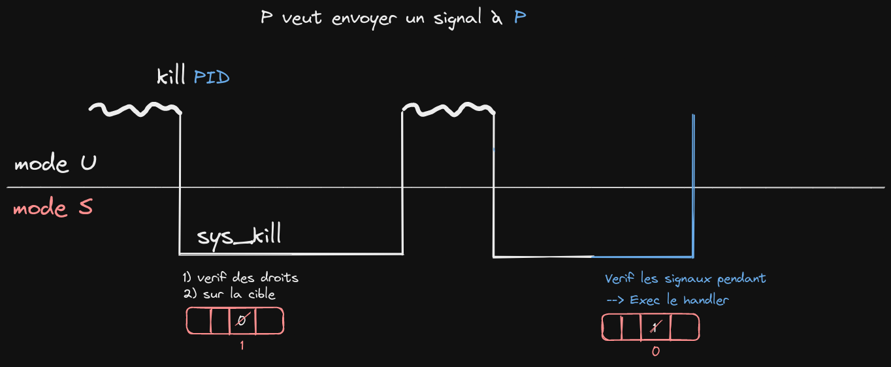
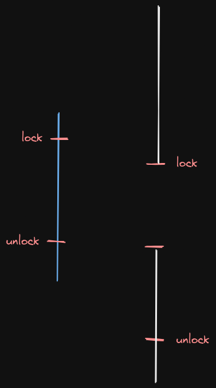
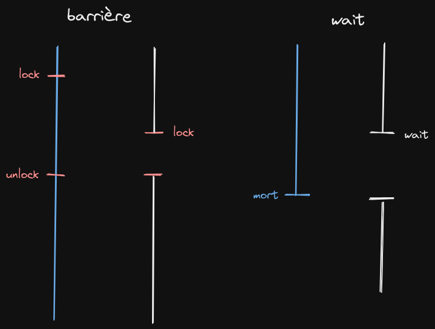

# Révisions 

## Signaux

- mécanisme de communication

- pourquoi -> pas le même espace d'adressage

- IPC (inter processus communication) -> signaux, tubes, mémoire partagée...

**Signal :** Mécanisme de communication inter-processus, signaux précis définis. En ISS -> signaux POSIX (norme)
Défini dans les données du kernel d'un processus (PID, PPID, etc...).

|0|0|1|0|1|0|...|
|-|-|-|-|-|-|---|

table des *signaux pendant*



- mécanisme asynchrone

- Le handler est executé (en mode U) quand le cible est réélue.

- dans les données du processus -> table des handlers qui contient les adresses des fonctions à executer

- les seuls signaux où on ne peut pas redéfinir le handler = STOP et KILL (pour permettre d'arrêter un processus)

⚠️ la commande `kill` est mal nommée, elle ne tue pas un processus mais envoie un signal

⚠️ dans le commande `trap`, utiliser des quote simples pour ne pas évaluer l'expression au moment de l'execution de la commande

```bash
trap 'i=$((i-1))' SIGTERM # évalue l'expression i=$((i-1)) à la réception du signal

trap "i=$((i-1))" SIGTERM # évalue d'abord l'expression qui devient donc i=1 par exemple, puis évalue i=1 à la réception du signal
```

## Synchronisation, wait

**pattern des sections critiques :**

Exemple de script :

```bash
read i < file
echo $((i+1)) > file
```

script lancé 2 fois en parallèle -> peut causer des problèmes

**exemple :** 

1) le premier script lit 0 dans le fichier

2) le deuxième lit 0 et écrit 1

3) le premier écrit aussi 1 -> pas le comportement voulu

ici, file est une **ressource partagée** et le code utilisant file est une **section critique**

**solution :** verrouiller la section critique avec un **lock** 

```bash
lock verrou
  read i < file
  echo $((i+1)) > file
unlock verrou
```

à partir du moment où le verrou est verrouillé, personne ne peut passer la ligne "lock verrou" tant qu'il n'a pas été déverrouillé

 

**pattern de la barrière (synchronisation) :**

Un premier processus crée un lock fermé. L'autre processus doit alors attendre l'unlock pour continuer (même chose qu'un wait mais le premier processus ne meurt pas)



